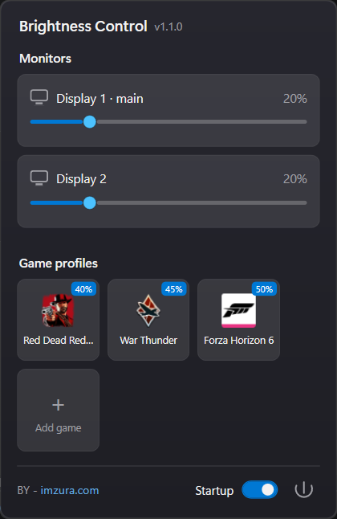

# Brightness Control — IMZURA

Control your **external monitors' brightness** right from Windows 11 — with **per‑game brightness
profiles** that switch automatically when a game launches and revert when it closes.

Built by **[zura](https://imzura.com)** · v1.1.0 · MIT licensed.

<p align="center">
  
</p>

## Features

- 🖥️ **External monitor brightness** over **DDC/CI** (HDMI / DisplayPort) — no laptop panel needed.
- 🎮 **Per‑game profiles** — e.g. Forza Horizon at 50%, Red Dead Redemption 2 at 40%. Brightness
  ramps to the game's profile the moment it starts and drops back to your idle profile when it exits.
- 🔎 **Auto‑detects installed games** from your **Steam** and **Epic** libraries — no need to have the
  game running to add it. (Falls back to a running‑process picker for other launchers.)
- 🌙 **Remembers your everyday level** — the brightness you set from the panel is restored
  automatically whenever no tracked game is running, so it's back to normal the moment a game closes.
- 🖥️ **Clear multi‑monitor labels** — each display is named by its **Windows display number**
  (Display 1 · main, Display 2…), matching Settings → Display.
- 🎨 **Windows 11 Start‑menu style** flyout with rounded tiles, real game icons, and your **system
  accent color**.
- 🚀 **Starts with Windows** (optional), lives quietly in the tray.

## Requirements

- Windows 11 (also works on Windows 10 21H2+).
- One or more **external** monitors with **DDC/CI enabled** in their on‑screen menu (most monitors;
  it's sometimes off by default).
- [.NET 8 Desktop Runtime](https://dotnet.microsoft.com/download/dotnet/8.0) to run a framework
  build, or use the self‑contained release (below) which needs nothing installed.

## Download & install

Grab **`BrightnessControl-Setup-1.1.0.exe`** from the [Releases](../../releases) page and run it — the
installer is **self‑contained** (no .NET runtime required), adds a Start‑menu shortcut, and can create
a desktop icon. Once installed, the app appears in your system tray — **left‑click** the icon to open
the panel. Toggle **Startup** in the panel to launch it with Windows.

## Build from source

```powershell
git clone <this-repo>
cd "Brightness Control"
dotnet build -c Release
dotnet run --project BrightnessControl
```

Produce a single self‑contained executable (no .NET install required on the target PC):

```powershell
dotnet publish BrightnessControl -c Release -r win-x64 --self-contained `
  -p:PublishSingleFile=true -p:IncludeNativeLibrariesForSelfExtract=true
```

The `.exe` lands in `BrightnessControl/bin/Release/net8.0-windows/win-x64/publish/`.

## How it works

- Brightness is read/written through `Dxva2.dll` (DDC/CI) — see `Services/MonitorController.cs`.
- Game start/stop is detected by lightweight process polling (no admin required) — see
  `Services/ProcessWatcherService.cs`.
- Installed games come from parsing Steam `.acf` manifests and Epic `.item` manifests — see
  `Services/SteamLibraryScanner.cs` and `Services/EpicLibraryScanner.cs`.
- Settings live in `%AppData%\Brightness Control\config.json`.

## License

[MIT](LICENSE) © 2026 **zura** — [imzura.com](https://imzura.com)
